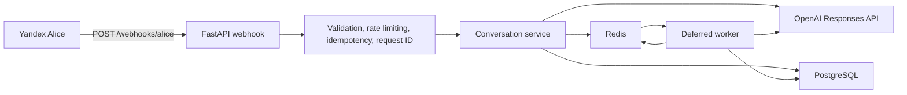

# Yandex Alice OpenAI

[](https://github.com/hu553in/yandex-alice-openai/actions/workflows/ci.yml)

- [License](./LICENSE)
- [Contributing](./CONTRIBUTING.md)
- [Code of conduct](./CODE_OF_CONDUCT.md)

FastAPI backend for a Yandex Alice skill that uses the OpenAI Responses API, keeps short-term dialog state
in Redis, stores analytics in PostgreSQL, and falls back to deferred replies when Yandex Alice's response deadline
is too tight.

## What it does

- Accepts `POST /webhooks/alice` requests from Yandex Alice.
- Tries a fast OpenAI request first with a strict timeout budget.
- Queues a deferred reply when the fast path is too slow.
- Returns ready deferred replies when the user says `продолжай` or `подробнее`.
- Applies Redis-backed idempotency and rate limiting.
- Emits structured JSON logs with request IDs.

## Components

- **api**: FastAPI webhook app for Yandex Alice
- **worker**: background deferred reply processor
- **redis**: conversation memory, idempotency, rate limiting, and queue state
- **postgres**: durable analytics storage
- **openai**: LLM provider accessed through the Responses API

## Architecture

### High-level flow



### Request lifecycle

1. Yandex Alice sends a webhook payload to `POST /webhooks/alice`.
2. FastAPI validates the payload, checks the optional webhook secret (`?secret=`) query parameter,
   reuses cached duplicate responses, and attaches a request ID.
3. The conversation service loads recent history from Redis and tries the OpenAI fast path with a hard timeout.
4. If the fast path succeeds, the response is normalized for speech, clipped to Yandex Alice limits, stored in Redis
   history, and mirrored to PostgreSQL.
5. If the fast path is too slow or fails, the request is marked as pending and queued for the worker.
6. The worker generates the deferred answer and marks it as ready in Redis.
7. When the user says `продолжай` or `подробнее`, the webhook returns the ready follow-up immediately.

## Quick start

1. Copy the environment template: `make ensure-env`
2. Set `OPENAI_API_KEY`
3. Start the services: `make start`

For local host-run development instead of Docker:

```bash
make ensure-env install-deps
docker compose up -d redis postgres
uv run yandex-alice-openai-api
```

In another shell:

```bash
uv run yandex-alice-openai-worker
```

## Common commands

```bash
make install-deps
make lint
make check-types
make test
make check
make start
make stop
```

## API

### Endpoints

- `POST /webhooks/alice`
- `GET /healthz`

See [Yandex Alice protocol](https://yandex.ru/dev/dialogs/alice/doc/ru/protocol.html) for the
request/response format.

## Configuration

Main settings live in `.env`:

- `APP_ENV`, `APP_HOST`, `APP_PORT`, `APP_LOG_LEVEL`
- `APP_RATE_LIMIT_PER_MINUTE`, `APP_WEBHOOK_SECRET`
- `OPENAI_API_KEY`, `OPENAI_MODEL`, `OPENAI_TIMEOUT_SECONDS`, `OPENAI_MAX_RETRIES`
- `OPENAI_WEB_SEARCH_ENABLED`, `OPENAI_WEB_SEARCH_CONTEXT_SIZE`, `OPENAI_SYSTEM_PROMPT`
- `REDIS_URL`, `REDIS_PREFIX`, `REDIS_SESSION_TTL_SECONDS`, `REDIS_SESSION_TURN_LIMIT`
- `REDIS_PENDING_TTL_SECONDS`, `REDIS_IDEMPOTENCY_TTL_SECONDS`, `REDIS_RATE_LIMIT_WINDOW_SECONDS`
- `DATABASE_URL`, `DATABASE_ECHO`
- `WORKER_POLL_TIMEOUT_MS`, `WORKER_IDLE_SLEEP_SECONDS`, `WORKER_JOB_TIMEOUT_SECONDS`

## Security defaults

- Optional webhook secret validation via `?secret=` query parameter
- Redis-backed rate limiting
- Idempotent duplicate request handling
- Strict Pydantic request validation
- Environment-based secrets only
- Request correlation ID in every response header

## Container publishing

- CI runs the same `prek`-based checks as local `make check`
- Pushes to `main` publish `latest` and `sha-*` images to GHCR
- Docker builds are pinned by `uv.lock`
