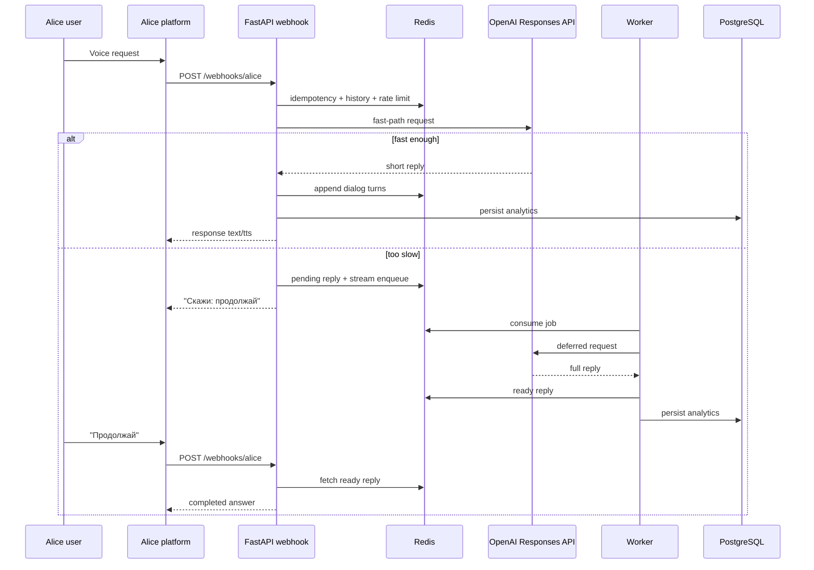

# Architecture Notes

## Request lifecycle

1. Alice sends a webhook payload to `POST /webhooks/alice`.
2. FastAPI validates the payload, checks webhook secret if configured, looks up the idempotency cache, applies Redis-backed rate limiting only for non-duplicate deliveries, and creates a request correlation ID.
3. The conversation service checks the idempotency cache again and returns the cached Alice response for duplicate webhook delivery.
4. For regular queries, the service loads short-term history from Redis and tries the OpenAI fast path with a hard timeout.
5. If the fast path succeeds, the answer is normalized for voice, clipped to Alice limits, stored in Redis history, and mirrored to PostgreSQL analytics.
6. If the fast path fails or exceeds the budget, the service stores a pending reply record and enqueues the job into Redis Streams.
7. While a pending reply is still processing or waiting to be delivered, the webhook blocks unrelated new questions to avoid mixing replies between turns.
8. The worker consumes the deferred job, reclaims stale unacked jobs if needed, calls OpenAI with a longer timeout, stores the ready reply in Redis, and persists analytics to PostgreSQL.
9. When the user says `продолжай` or `подробнее`, the webhook returns the ready chunk immediately from Redis.
10. If rate limiting or an unexpected backend fault happens after payload validation, the webhook still returns an Alice-compatible spoken fallback instead of a raw JSON error body.

## Mermaid

